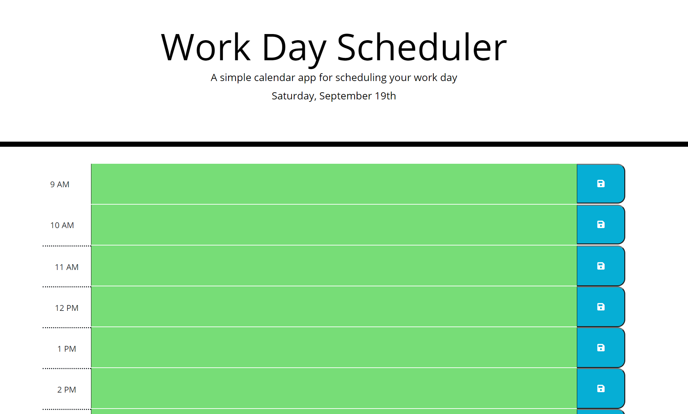

# workDayScheduler

This application will let you organize your working day. It is set up with a 9 to 5 schedule. You can add text to each hour and save it with the save button on the left. Everything that is saved will remain on the page after refresh. Also, once the current time has surpassed the time on the boxes, those boxes will turn gray. The boxes with the current time will be red. Lastly, the boxes with the hours passed the current time will be in green. The screenshot was taken before 9am, which is why all boxes are green.

## Link of the application

https://tiroxxx.github.io/workDayScheduler/